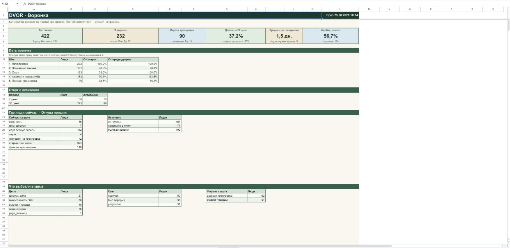

# Telegram-бот запуска курса — техническое задание (MVP)

Согласовано по ответам заказчика, 26.08.2026.

---

## 1. Задача

Автоматизированная воронка **внутри Telegram** под ближайший запуск курса (колористика / лид-магнит + продажа потока).

Человек приходит из Reels, Stories, постов, Threads, Telegram и прямых ссылок → получает бесплатный материал → не выпадает из прогрева → в любой момент может записаться на курс → оплачивает онлайн → после полной оплаты (или после списания по рассрочке) получает доступ в закрытый канал этого запуска через одноразовую ссылку.

MVP — **один запуск и один лид-магнит**. Второй и третий продукт — после первого живого запуска, ориентир **ноябрь**. Схему сразу делаем так, чтобы следующий поток не требовал бота с нуля.

---

## 2. Что будет использоваться

| Компонент       | Решение                                                                           |
| --------------- | --------------------------------------------------------------------------------- |
| Мессенджер      | Telegram Bot API, личные сообщения                                                |
| Режим работы    | Long polling (бот сам забирает обновления). Публичная «страница бота» не нужна    |
| Хранение        | SQLite на сервере: люди, источники входа, статусы, заказы, лог касаний            |
| Хостинг         | VPS + Docker Compose, постоянный диск под базу, бэкап файла БД                    |
| Админка         | Личка бота у указанных Telegram-аккаунтов (не отдельный сайт)                     |
| Закрытый доступ | **Отдельный канал на каждый запуск**; бот — администратор с правом приглашать     |
| Лид-магнит      | PDF (файл в Telegram) или ссылка на материал — на выбор при сдаче                 |
| Оплата          | Сначала **LeadPay**; если автостатус в боте не получается — **ЮKassa**            |
| Рассрочка       | На стороне кассы, без графика платежей внутри бота                                |
| Аналитика       | Метки в ссылке (`t.me/бот?start=метка`) + срез воронки в Google Sheets            |

Конструкторы вроде Salebot / BotHelp / GetCourse **не** используются: свой бот, свои сценарии, свои статусы.

После сдачи всё это **твоё**: бот в BotFather (токен), канал запуска, Google-таблица, база на сервере и бэкапы, доступы к VPS. Разработчик не оставляет себе «копию бота». Касса — твой кабинет: платежи и чеки идут на тебя.

---

## 3. Что входит в MVP

### 3.1. Вход из разных источников

Все внешние материалы ведут в одного бота, но **разными ссылками**. По человеку видно, с какой метки он впервые нажал Start.

Стартовый набор меток (расширяемо):

| Откуда                | Куда ведём      | Пример метки     |
| --------------------- | --------------- | ---------------- |
| Instagram Reels       | Бесплатный гайд | `ig_reels_guide` |
| Threads, пост         | Бесплатный гайд | `threads_guide`  |
| Telegram, анонс курса | Карточка курса  | `tg_announce`    |
| Прямая ссылка         | Курс            | `direct_course`  |

Дополнительные метки (Stories, рассылка, таргет) добавляются без переписывания воронки.

Повторный переход по другой ссылке не ломает уже идущий сценарий. Первый источник сохраняем для сводки «какой контент приводит».

### 3.2. Лид-магнит

Путь: Start → предложение гайда по колористике → подтверждение в Telegram (без имени, почты и телефона) → бот сразу отдаёт PDF или ссылку.

**Сразу после выдачи гайда** уходит первое сообщение прогрева. Дальнейшая цепочка и интервалы — по текстам заказчика, когда будут готовы. До этого в боте каркас: шаги, кнопки, первое касание после гайда.

В каждом сообщении воронки доступна кнопка **«Записаться на курс»**. Прогрев не блокирует запись.

В сообщениях прогрева — кнопка **«Не писать»**. После отписки бот не шлёт прогрев; гайд и запись остаются. Напоминания про уже начатую оплату / доплату отписка не глушит.

Исходящие от бота (прогрев и напоминания) уходят **не ночью**: окно по умолчанию **10:00–21:00 по Москве**. Окно можно сменить до запуска.

### 3.3. Запись на курс и статусы

Лимита мест **нет**. Предоплата — это разбивка платежа, а не «бронь слота».

Бот знает этап человека:

- пришёл (есть источник);
- получил гайд;
- в прогреве;
- начал оформление;
- внесена предоплата (есть остаток и дата доплаты);
- оплачено полностью / списание по рассрочке;
- доступ в канал выдан;
- оплата не завершена / отменена админом.

Админ видит статус в карточке и может поправить вручную (перевод вне кассы, сбой, возврат).

### 3.4. Оплата

На «Записаться на курс»:

- предоплата;
- оплатить полностью;
- рассрочка — **только на странице кассы**, бот график «платёж 2 из 6» не ведёт.

Бот отдаёт кнопку «Оплатить», после успеха кассы сам меняет статус. Кто уже получил доступ (полная оплата или списание по рассрочке), в продающую цепочку не попадает.

**Доступ в канал:**

| Как платили        | Когда бот выдаёт invite                                      |
| ------------------ | ------------------------------------------------------------ |
| Полная оплата      | После успешного платежа                                      |
| Предоплата         | **Нет**, пока не внесён остаток (полная сумма)               |
| Рассрочка          | После **фактического списания**, не после «заявка одобрена»  |

Касса: сначала смотрим **LeadPay** по доступам заказчика. Если персональная ссылка + автостатус в боте не получается — берём **ЮKassa**, сумма MVP не меняется.

### 3.5. Брошенная оплата

Если нажали «Оплатить», а успеха нет:

- первое касание через несколько часов: «оформление началось, оплата не завершилась» + **«Продолжить оплату»**;
- второе касание примерно через сутки.

Интервалы можно уточнить вместе с цепочкой прогрева. Кто уже оплатил — в эти касания не попадает.

### 3.6. Только предоплата

Бот подтверждает, что предоплата прошла, называет остаток и дату, к дедлайну напоминает, принимает доплату. Доступ в канал — **только после полной суммы**. Место никого не «держит» и само не освобождается: лимита нет.

### 3.7. После полной оплаты / списания по рассрочке

Автоматически:

1. Сообщение, что оплата прошла.
2. Персональная одноразовая ссылка в **канал этого запуска**.
3. Если ссылку не использовали — можно запросить новую (старая отключается).

Общую вечную ссылку не публикуем. Ученик прошлого потока в канал нового запуска сам не попадает — на поток отдельный канал.

Возврат и отмена: человек пишет админу, админ вручную снимает статус / доступ. Бот возврат в кассе не проводит.

### 3.8. Администрирование

В личке бота у команды:

- поиск человека;
- карточка: источник, статус, платежи, был ли вход в канал;
- ручное подтверждение оплаты и выдача доступа;
- отмена / возврат вручную (человек пишет админу);
- рассылка сегменту (например: получили гайд и не купили).

Цифры воронки и источников — в Google-таблице (п. 3.9).

### 3.9. Срез воронки в Google Sheets

Бот сам обновляет вкладку-дашборд в таблице (срез пересобирается, руками лист не правят).

На срезе:

- карточки сверху: сколько нажали Start, сколько в воронке, сколько взяли гайд, сколько начали оплату, сколько купили;
- путь по шагам с % от старта и от предыдущего шага;
- динамика за 7 и 30 дней;
- где люди сейчас и **откуда пришли** (Reels / Threads / Telegram / прямая ссылка).

Пример вида среза (цифры чужие; у курса шаги: гайд → прогрев → оплата, не квиз клуба):

Таблица — твоя: доступ редактора сервисному аккаунту бота. Это сводка, не список «каждый человек». Карточка человека — в админке бота.

---

## 4. Как это выглядит для человека (коротко)

1. Кликает ссылку из Reels / Threads / поста → Start.
2. Бот предлагает гайд (или сразу курс — если ссылка «на курс»).
3. Забирает материал в Telegram, без анкеты. Сразу после гайда — первое сообщение прогрева.
4. Может сразу нажать «Записаться» или читать дальше — бот пишет по цепочке, когда она будет в боте.
5. На записи: полная оплата, предоплата или рассрочка в кассе.
6. После полной оплаты (или списания по рассрочке) — invite в канал **этого** запуска. После одной предоплаты канала ещё нет.

---

## 6. Сложные места — заранее

**Касса.** Сначала LeadPay по твоим доступам (1–2 дня спайка). Нужны уникальная ссылка на человека и сигнал боту, что деньги пришли. Если этого нет — ЮKassa, без пересмотра цены MVP.

**Рассрочка.** Живёт в кассе. Бот не ведёт график. Invite — после списания, не после одобрения заявки.

**Доплата после предоплаты.** Второй платёж в том же боте, с датой и напоминаниями. Канала до полной суммы нет.

**Канал на запуск.** Не общий «навсегда». Прошлый поток ≠ доступ к новому.

**Одноразовые invite.** Бот — админ канала с правом приглашать. Ссылку можно перевыдать.

---

## 7. Оплата: как закрыли

Онлайн, не «скинь скрин админу» как основной путь.

| Вариант                             | Роль в MVP                                                                 |
| ----------------------------------- | -------------------------------------------------------------------------- |
| **LeadPay**                         | Первый заход: доступы даёт заказчик, проверяем автостатус                  |
| **ЮKassa, страница оплаты**         | Запасной шлюз, если LeadPay в самописный бот не стыкуется                  |
| Telegram-счёт (ЮKassa внутри чата)  | Не берём: рассрочка кассы туда обычно не влезает                           |
| Ссылка + скрин + админ              | Только запас: сбой кассы, перевод вне кассы, ручной override               |

Ручное «отметить оплаченным» в админке есть в любом случае.

Чеки 54-ФЗ — настройки твоего кабинета кассы, не отдельная разработка в боте.

---

## 8. Что нужно от заказчика

Ориентир по организационке: **ближайшие 2 дня** (как договорились). Тексты цепочки — отдельно, каркас бота на них не стоит.

### Чтобы стартовать разработку и спайк кассы

- Доступы **LeadPay** (кабинет / токен «для внешних систем» / что выдадут).
- @username бота (или согласовать, заведём).
- Закрытый **канал этого запуска** и готовность сделать бота админом с правом приглашать.
- PDF гайда (или URL).
- Цена курса, размер предоплаты, дата доплаты (лимита мест нет).
- Список админов: Telegram user id через @userinfobot.
- Google-таблица под срез воронки (или пустая — заведём).
- Оферта / что показать перед оплатой, если уже есть.

### Для живого запуска (можно параллельно, не блокирует каркас)

- Все тексты и цепочки прогрева. Первое сообщение **сразу после гайда** — точно будет; остальное подставим, когда пришлёшь.
- Интервалы двух касаний «не оплатил», если не оставляем «через несколько часов» и «через сутки».
- Окно «не писать ночью», если не 10:00–21:00 МСК.
- Тестовый платёж в кассе (10 ₽), когда шлюз выбран.

Без полной цепочки бот можно вести и тестировать на заглушках. В прод с продающим прогревом — после copy.

---

## 9. Согласованные решения

Раньше это были открытые вопросы. Зафиксировано:

| Тема                         | Решение                                                                 |
| ---------------------------- | ----------------------------------------------------------------------- |
| Бренд и тон                  | Тексты и цепочки готовит заказчик                                       |
| Доступ в канал               | Только после полной оплаты; рассрочка — после списания                  |
| Лимит мест                   | Нет                                                                     |
| Регистрация на гайд          | Только Telegram, без почты и телефона                                   |
| Первое касание после гайда   | Сразу. Дальнейшая цепочка — когда будут тексты                          |
| Рассрочка                    | На стороне кассы; доступ после списания                                 |
| Прошлый поток                | Отдельный канал на запуск                                               |
| Возврат и отмена             | Вручную: пишут админу                                                   |
| Второй и третий продукт      | После первого запуска, ориентир ноябрь                                  |
| Касса                        | Сначала LeadPay, если не проходит — ЮKassa                              |

---

## 10. Этапы и срок

Ориентир при доступах к кассе и боту в ближайшие дни.

| Этап                | Содержание                                                           | Срок                   |
| ------------------- | -------------------------------------------------------------------- | ---------------------- |
| 0. Спайк кассы      | LeadPay по доступам; если нет — ЮKassa                               | 1–2 рабочих дня        |
| 1. Каркас           | Бот, база, админы, деплой, /start                                    | параллельно со спайком |
| 2. Воронка          | Метки, гайд, первое сообщение после гайда, кнопка записи             | 3–5 дней               |
| 3. Деньги и доступ  | Статусы, касса, брошенная оплата, предоплата/остаток, invite         | 5–7 дней               |
| 4. Админка и сводки | Карточка, рассылка, Google Sheets, ручной override                   | 2–3 дня                |
| 5. Приёмка          | Тестовые оплаты, подстановка текстов, запуск                         | 1–2 дня                |

**Календарно: около 2–3 недель** на MVP одного запуска.

Оплата работ — **два транша с паузой в неделю** (см. §11).

---

## 11. Стоимость

### 11.1. Разовая разработка MVP (один курс, один гайд, одна воронка)

**80 000 ₽** — пакет с онлайн-кассой (LeadPay или ЮKassa по итогам спайка), канал, админка, срез в Sheets.

Если ни одна касса не даёт автостатус — упрощённый контур «ссылка + подтверждение админа», **55 000 ₽**. Это запас, не цель.

В 80 000 уже есть: брошенная оплата, предоплата и доплата, одноразовые invite, ручной override, отчёт по меткам. Нет: лендинг, съёмка гайда, регистрация ИП/кассы «под ключ», реклама, второй продукт (ноябрь — отдельно).

**Разбивка:**

1. **40 000 ₽** — до старта работ (когда есть доступы из §8 на спайк и бота).
2. **40 000 ₽** — через неделю.

Пауза — между платежами, разработка между траншами не останавливается, если второй транш приходит в срок.

### 11.2. Поддержка после запуска

Первые **две недели** после запуска — правки багов по MVP, без новой логики, в рамках сдачи.

Дальше доработки (новые шаги, метки, второй продукт в ноябре) — **1 800 ₽/ч**, по согласованной задаче. Фиксированного пакета в месяц нет.

VPS — примерно **350 ₽/мес**, оплачивает заказчик. Комиссия кассы и реклама — тоже на заказчике.

---

## 12. Приёмка MVP

Считаем сделанным, если на тестовом контуре:

- четыре стартовые метки открывают нужный сценарий (гайд vs курс), источник виден в карточке;
- гайд уходит без анкеты; сразу после него — первое сообщение прогрева;
- из прогрева можно отписаться; напоминания не уходят ночью;
- «Записаться» доступна до выдачи доступа;
- тестовый платёж выбранной кассы меняет статус без админа;
- «не оплатил» уходит два раза и не уходит оплатившему;
- предоплата → виден остаток → доплата → статус «полностью» → только тогда invite;
- рассрочка: invite после списания, не после «заявка»;
- после полной оплаты / списания — одноразовая ссылка в канал запуска, вход фиксируется;
- ученик «прошлого» канала в новый сам не попадает;
- админ может проставить оплату, отменить вручную и сделать рассылку «не купившим»;
- в Google Sheets есть срез: шаги воронки и источники входа.
